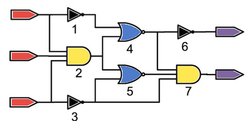
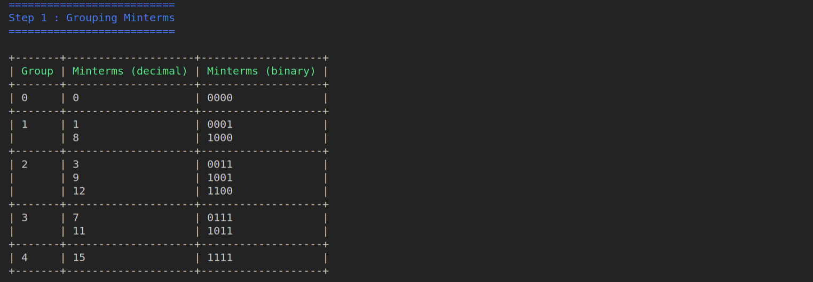
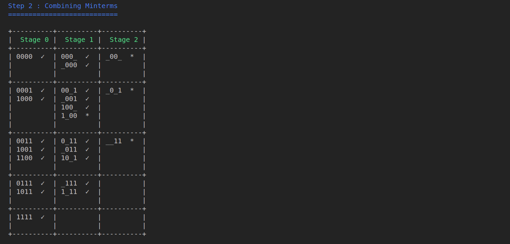
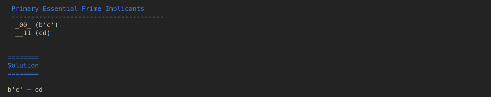

<p align="center">
	<a href="https://www.hackerrank.com/profile/kumbonghermann"></a>
</p>
<p 
<h1 align="center">
    Quine McCluskey Circuit Minimizer.
</h1>
  <p align="center">
 
 
 
  
 
 
 

 </p>

A robust :hammer:, insanely fast :zap: and stupidly easy to use :sleeping: CLI tool for minimizing sum of products via the Quine Mccluskey minimization technique.

## Features :gem:
   * Written in uncomplicated python :innocent:
   * Supports don't cares and variables for representing expression
   * Display of all steps leading to solution :droplet:
   * Works on Mac, Linux and Windows
   * Provides all other alternative solutions to the minimization problem
   
## Installation :package:
1. Clone the repo
```bash
   git clone https://github.com/Kumbong/quine_mccluskey.git
   cd quine_mccluskey
```
2. Install dependencies
```bash
   pip install -r requirements.txt
```

## Usage :computer:
You can use the following optional arguments according to your needs: 

   * `-d`, `--dcares` (list of numbers): **list of dont't cares (default=[ ])**
   * `-v`, `--variables` (list of chars): **list of characters for representing result (default = [ ])**
   * `-s`, `--show_steps` (yes|no): **show steps leading to solution (default=yes)**
   * `-p`, `--show_step` (sum of products): **sum of products are used to be reduce the function**
   * `-m`, `--show_step` (minterms): **sum of minterms are used to be reduce the function**
   
Example
```bash
    python -m qmccluskey -m 0,1,3,7,8,9,11,15 -d 12  -v a,b,c,d
    python -m qmccluskey -p a'b'c'+b'cd'+a'bcd'+ab'c' -v a,b,c,d
```

## Demo :movie_camera:
   Solution for the the Example above
   
   
   
   
   
   
## Contributing :gift: [](https://github.com/dwyl/esta/issues)
Pull requests are welcome. For major changes, please open an issue first to discuss what you would like to change.
Please make sure to update tests as appropriate.

## Want to talk more??
 If you are interested in helping or have something to suggest or just want to chat with me, you can reach me through the following media .
* Email - kumbonghermann@gmail.com
* Follow me on 
* Let's connect on 
* I'm on  

## References :book:
* Petrick's method 
    https://en.wikipedia.org/wiki/Petrick%27s_method
* quine mccluskey also in python
    https://github.com/tpircher/quine-mccluskey
* readme.md
    https://github.com/karan/joe

## Todos :pencil:
 - Automate build
 - Improve code quality to A+
 - Complete GUI module
 - Write tests
 - Include steps for petrick's method


License :key:
----

MIT &copy; Kumbong Hermann

